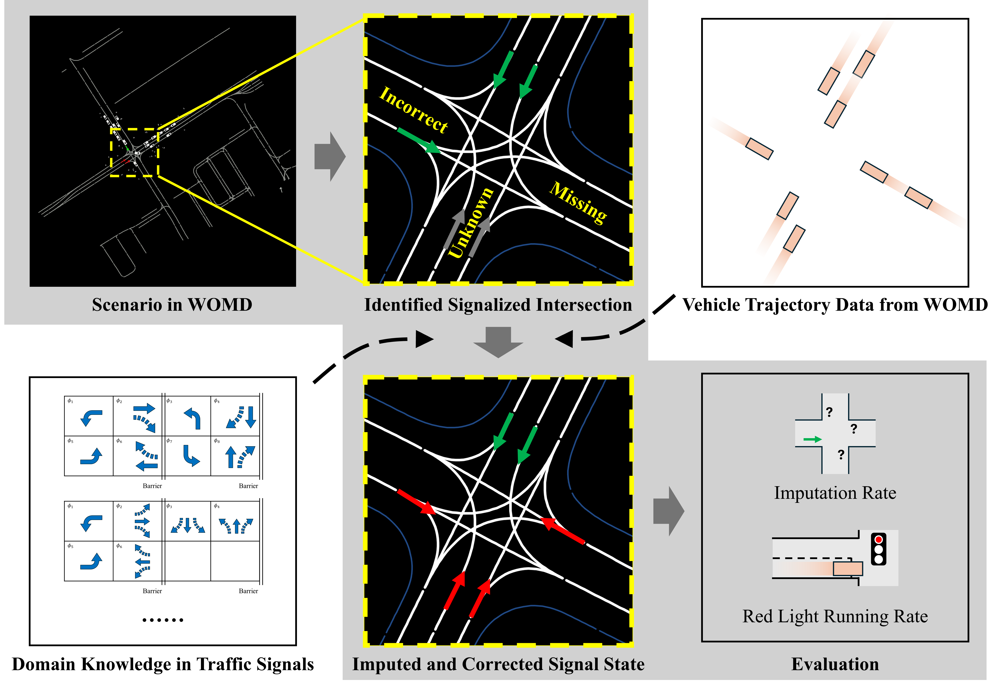

# Improving Traffic Signal Data Quality for the Waymo Open Motion Dataset
[Xintao Yan](), Erdao Liang, Jiawei Wang, Haojie Zhu, Henry X. Liu
### [Paper]() | [Project Page]()


## About



This repository provides an open-source implementation and resources for our work **Improving Traffic Signal Data Quality for the Waymo Open Motion Dataset**. In many autonomous driving datasets (including the Waymo Open Motion Dataset), traffic signal states may be missing, unknown, or occasionally inaccurate. Such issues can compromise downstream tasks like trajectory prediction, motion planning, and traffic simulation.

Our approach automatically **identifies signalized intersections** from map data, **infers or corrects traffic signal states** using vehicle trajectory data and domain knowledge (e.g., standard ring-and-barrier diagrams), and then reconstructs a complete, consistent set of traffic signal states for each scenario. We validate the method over more than 530,000 scenarios in the Waymo Open Motion Dataset, successfully imputing missing signal states (about 71.7% of all states) and reducing unrealistic red-light violations from 15.7% to 1.3%.

If you find this project useful, please consider citing the following paper:

```
TBD
```

## Environment Setup

1. Clone the repository, and create a conda environment by running the following code:
    ```
    conda env create --name womd_tls python=3.9
    conda activate womd_tls
    pip install -r requirements.txt
    ```

2. Install the [Waymo Open Motion Dataset](https://github.com/waymo-research/waymo-open-dataset) SDK manually from the .whl file, as installing it via pip is not supported in some systems.
    ```
    wget https://files.pythonhosted.org/packages/14/99/7d36e6fd9ea4d676d1187c1698f6d837d151ea04fc3172c5c6e9dfa2806d/waymo_open_dataset_tf_2_12_0-1.6.4-py3-none-manylinux_2_24_x86_64.manylinux_2_28_x86_64.whl
    pip install waymo_open_dataset_tf_2_12_0-1.6.4-py3-none-manylinux_2_24_x86_64.manylinux_2_28_x86_64.whl
    rm waymo_open_dataset_tf_2_12_0-1.6.4-py3-none-manylinux_2_24_x86_64.manylinux_2_28_x86_64.whl
    ```

3. Download Waymo Open Motion Dataset from the [official website](https://waymo.com/open/download/#). 
    - We use version v1.2.0. Navigate to the download page, find the "Version history" link under "Motion Dataset". You will find version v1.2 published in March 2023.
    - In the Google Cloud Storage page that opens, navigate through:
        ```
        waymo_open_dataset_motion_v_1_2_0
        └── uncompressed
            └── scenario
                └── training
                    └── ...
                └── validation
                    └── ...
        ```
     
    - If you just want to try out the code, downloading the entire dataset is not necessary. You can download a single shard (e.g., validation/validation.tfrecord-00000-of-00150) from either the training or validation folder for a quick test.

## Example Usage

Our method is fully open-sourced, feel free to have a try and look into the code. But if you only want to use the updated traffic signal data for your project, we have also provided the updated data that is immediately available to use.

### Using the Improved Traffic Signal Data

In the Waymo Open Motion Dataset (WOMD), each TFRecord shard contains roughly 300–500 scenarios, each representing a 9-second snapshot of the world sampled at 10 Hz. Each scenario include static map data, traffic signal data and agent trajectories. To see the concrete definition, please refer to [scenario.proto](https://github.com/waymo-research/waymo-open-dataset/blob/62b97ad80bbff8b285dda3a9fb679888d34e6b17/src/waymo_open_dataset/protos/scenario.proto). Traffic signal information of a scenario lives in its `dynamic_map_states` attribute.

Our method has been applied to all training and validation scenarios in WOMD. We export the updated traffic signal data, packed in the same TFRecord format, to align with Waymo’s original file structure.

1. Download [training set](TBD) and/or [validation set](TBD) and unzip them. The file names match the original data exactly: for example, if a scenario belongs in `validation.tfrecord-00000-of-00150`, the improved version will be in a file named `validation.tfrecord-00000-of-00150-new`.

2. In the updated version, we only keep two fields, `scenario_id` and `dynamic_map_states`, erasing any others. To obtain a complete updated scenario, just load the original scenario from the raw dataset, and replace the `dynamic_map_states` field with our improved version.

3. You can find an example in [scripts/example_useonly.py](./scripts/example_useonly.py) for a simple illustration on how to load and merge the improved data.

### Runing Our Code to Generate Traffic Signal Data

You can find an example in [scripts/example_runcode.py](./scripts/example_runcode.py).

Core algorithms related to traffic signal imputation and correction are defined in [src/processor/tlsgenerator.py](./src/processor/tlsgenerator.py).


## Liscense

This software is made available for non-commercial use under a creative commons [license](./LICENSE). You can find a summary of the license [here](https://creativecommons.org/licenses/by-nc/4.0/).